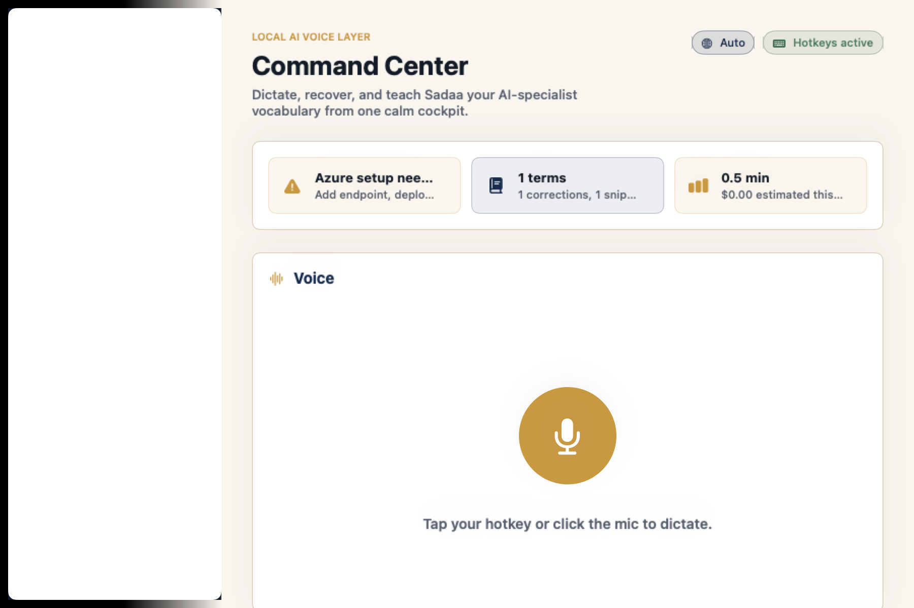
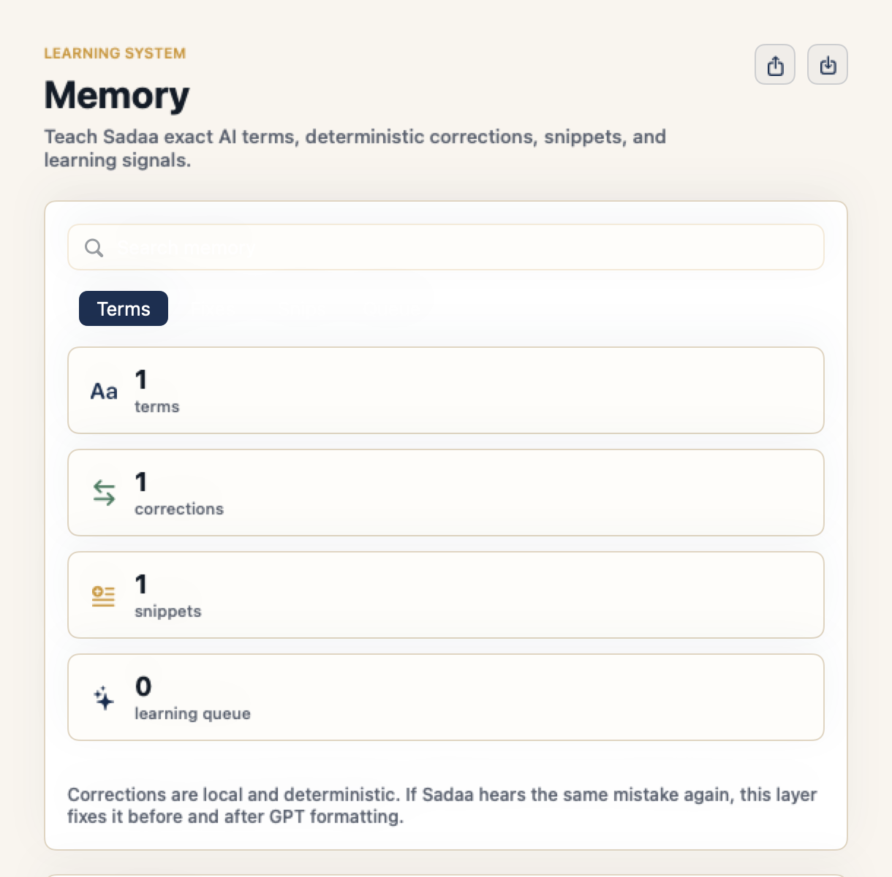
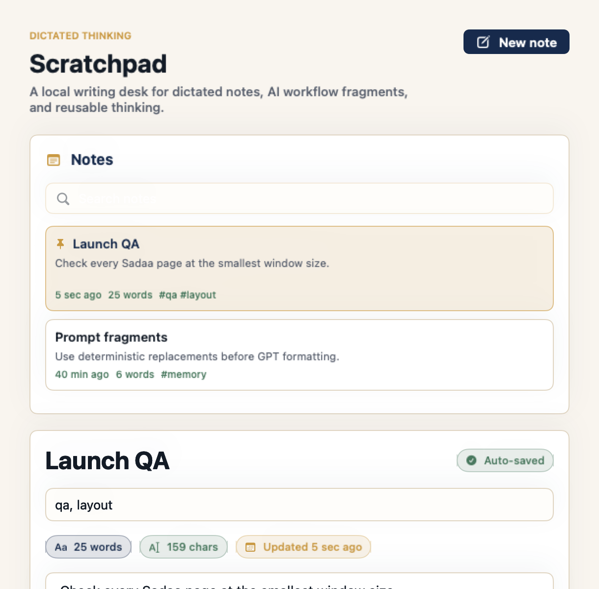
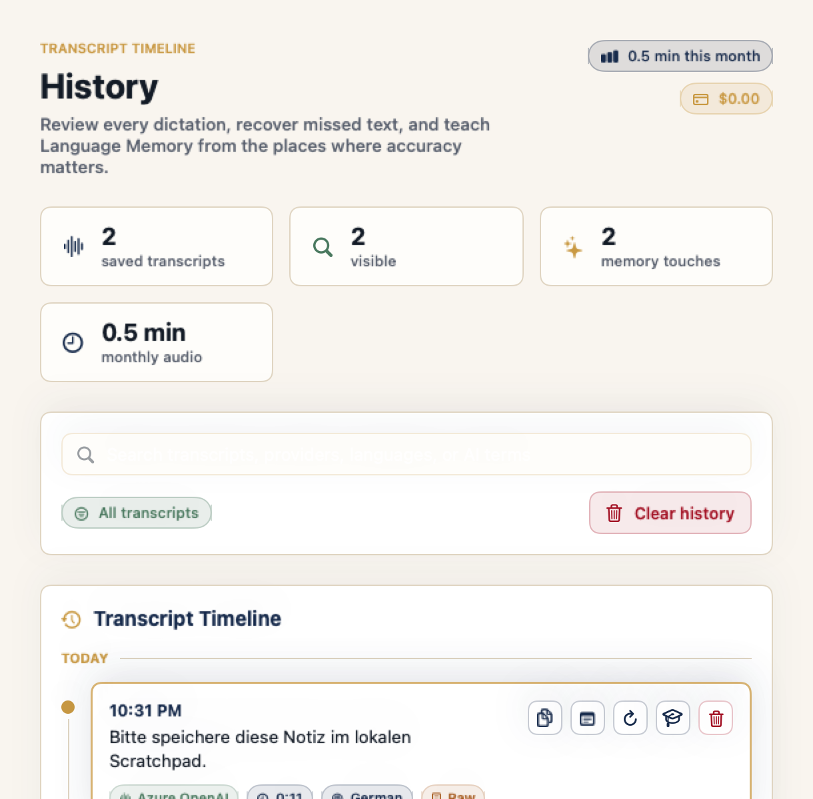
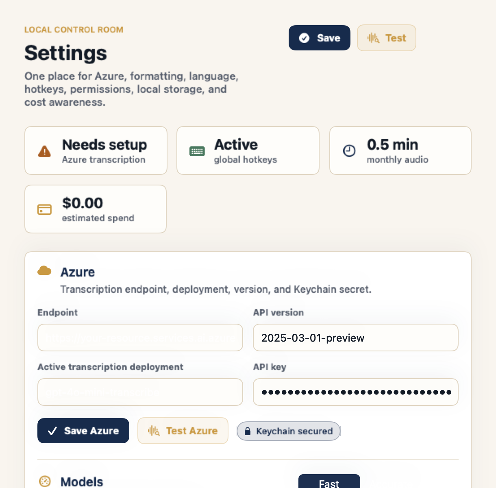

# Sadaa UI Audit And Fixes - 2026-06-26

## Scope

Manual-style UI audit of the current macOS app shell and every main page: Home, Memory, Scratchpad, History, and Settings. Native `screencapture` and AppleScript UI inspection were blocked by macOS Screen Recording / Assistive Access permissions in this Codex session, so the visual evidence below was captured with an offscreen SwiftUI renderer using the same page views and seeded local data.

## Bugs Found And Fixed

1. **Memory, Scratchpad, History, and Settings clipped horizontally at the effective minimum window width.**
   - Evidence: the detail area at the app's 900px window width leaves about 610px after the sidebar; fixed three-column layouts exceeded that width and hid left/right content.
   - Fix: added compact `ViewThatFits` fallbacks, vertical outer scrolling for Memory and Scratchpad, and adaptive metric/control grids.

2. **Native text editors and rounded text fields could render dark system chrome inside the light cream UI.**
   - Evidence: Scratchpad editor and tags field rendered with dark native backgrounds in the offscreen page capture, making text hard to read.
   - Fix: hid native scroll backgrounds for app `TextEditor`s and added shared `premiumInputChrome()` for page form fields.

3. **Sidebar used a made-up waveform mark instead of the original Sadaa logo.**
   - Evidence: `RootView.brand` drew a gold rounded rectangle with SF Symbol `waveform`.
   - Fix: sidebar now loads `SadaaLogo.png` first, falls back to `Sadaa.icns`, and the bundle step copies the original cream-background logo into app resources.

4. **Clickable controls did not consistently use a pointer cursor.**
   - Evidence: plain icon buttons, sidebar rows, action rows, toggles, pickers, and native-style buttons relied on the default cursor.
   - Fix: added shared `clickableCursor()` and applied it to custom button styles, sidebar items, action rows, mic button, utility buttons, pickers, toggles, and page buttons.

## Screenshots After Fix

## Verification

- `swift build` passed.
- `make test` passed: 227 tests in 37 suites.
- `make bundle` passed and copied `SadaaLogo.png` into `dist/Sadaa.app/Contents/Resources`.
- `codesign --verify --deep --strict --verbose=2 dist/Sadaa.app` passed.
- `open dist/Sadaa.app` launched successfully; the visible Sadaa window reported bounds `900 x 632`.
